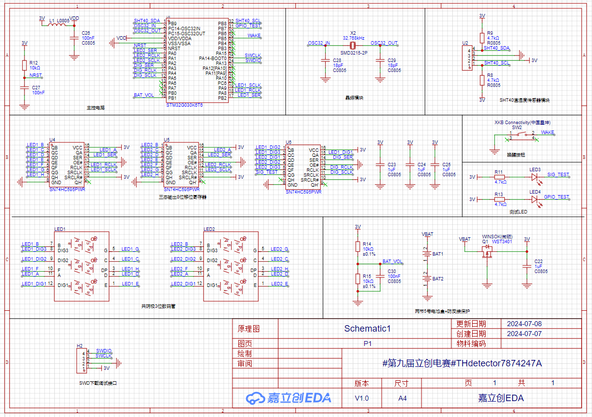
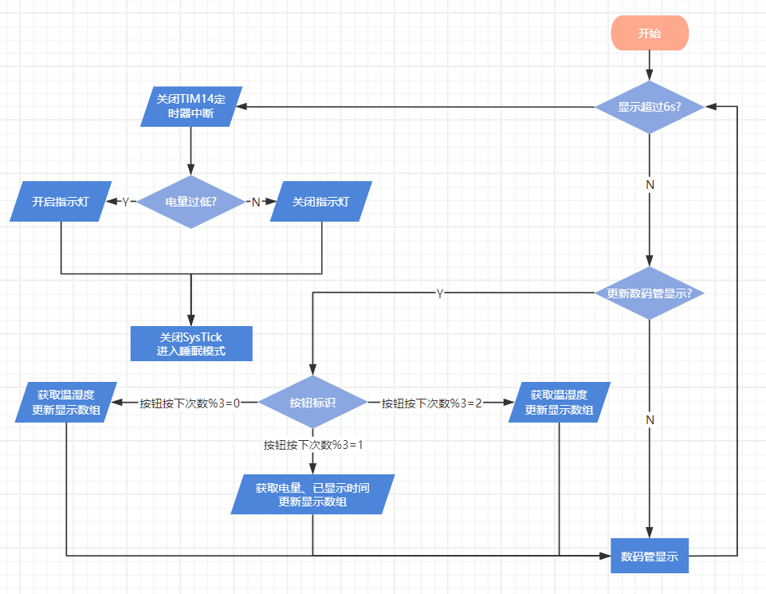
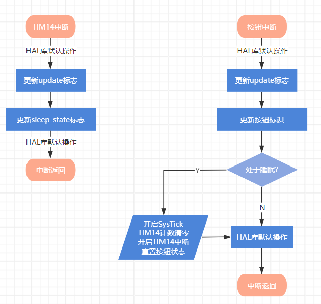

# 简易温湿度检测仪

## * 项目功能介绍

- 主控芯片为意法半导体的 STM32G030K6T6 芯片
- 使用数码管显示当前测量的温湿度信息
- 使用盛思锐温湿度传感器模块获取温湿度
- 小摆件，用于桌面装饰品，需要查看时通过按钮唤醒，节省功耗
- 具备一定的电量监测功能

## * 项目属性

- 功能特点：按需检测温湿度，数字显示
- 技术核心：高精度传感器，简易电路设计
- 应用场景：室内环境监测与调节
- 开发周期：预计 1 ~ 7 天
- 预算范围：50 ~ 100 ￥

## * 硬件设计

### 1、原理图设计

### 2、注意事项

- 低功耗睡眠模式下是不能进行程序下载的，本项目没有提供复位按钮，在误操作导致芯片只能运行一两秒的情况下，需要手动将主控芯片的NRST引脚与地短接，而后才能再次写入程序，所以建议添加一个复位按钮（后知后觉）

### 3、优化建议

- 程序下载：可增加复位按钮，可以解决上面的问题，可增加USB接口、串口下载模块，实现程序下载功能（方便，贵了）
- 按钮控制：可以使用无线模块替换
- 电池供电：可增加USB接口、充放电模块，实现充电功能
- 信息显示：可更换为LCD、墨水屏等，可添加时间显示功能

## *5、软件设计

软件流程图：

 
